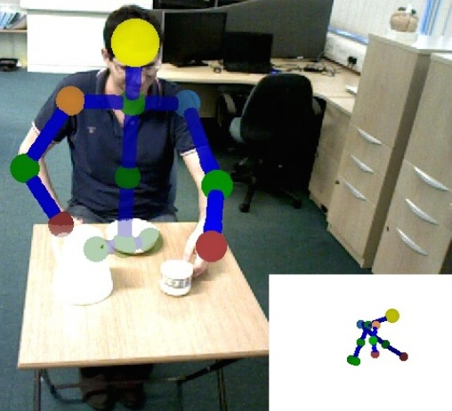

.. QSRlib documentation master file, created by
   sphinx-quickstart on Thu Sep 10 15:48:19 2015.
   You can adapt this file completely to your liking, but it should at least
   contain the root `toctree` directive.

=============
QSRlib's docs
=============

QSRlib is a library that allows computation of Qualitative Spatial Relations and Calculi, as well as a development framework for rapid implementation of new QSRs.

The aims of QSRlib are to:

* provide a number of QSRs that are well known, and in common use in scientific community;
* expose these QSRs via a standard IO interface that allows quick and easy re-usability, including a ROS interface to allow use in cognitive robotic systems;
* provide a flexible and easy to use infrastructure that allows rapid development of new QSRs that extend the library;
* deliver abstracted QSRs over time in an aggregated representation that facilitates further inference.

A typical usage of QSRlib would be an intelligent system, such as a robot for example, which acquires visual data via an RGB-D camera, such as a Kinect,  and via object recognition and skeleton tracking is able to perceive the individual entities in the world. The system can then make calls to QSRlib in order to abstract this input data and form a qualitative representation of the perceived world scene. This could then be used to recognise activities in natural scenes such as the one shown in the image below, using already learnt models expressed using QSRs in the QSRlib library.

QSRlib has been used in various research and teaching projects. Some selective case studies are briefly described. In [1]_ QSRlib was used to rapidly experiment with multiple different types of qualitative representations in order to identify the most suitable one for learning human motion behaviours as perceived by a mobile robot that was deployed for a duration of 6 weeks in an office environment. QSRlib was used to quickly experiment with suitable representations for classifying scenes and environments from visual data [2]_ [3]_. The library was also used to compute qualitative relations between a robot and humans moving in order to plan and execute safe path navigation taking into consideration their movement patterns [4]_. The library has also been used in a number of teaching projects (e.g. recognizing gestures for controlling a device, recognizing someone having breakfast, etc.), allowing the students to concentrate on the more interesting, high level, parts of their projects rather than spending a good portion of their project time in developing the low level tools they need (and which are the same from project to project).

.. [1] Duckworth, P.; Gatsoulis, Y.; Jovan, F.; Hawes, N.; Hogg, D. C.; and Cohn, A. G. 2016. Unsupervised Learning of Qualitative Motion Behaviours by a Mobile Robot. In Proc. of the Intl. Conf. on Autonomous Agents and Multiagent Systems (AAMAS’16).
.. [2] Thippur, A.; Burbridge, C.; Kunze, L.; Alberti, M.; Folkesson, J.; Jensfelt, P.; and Hawes, N. 2015. A Comparison of Qualitative and Metric Spatial Relation Models for Scene Understanding. In 29th Conference on Artificial Intelligence (AAAI’15).
.. [3] Kunze, L.; Burbridge, C.; Alberti, M.; Thippur, A.; Folkesson, J.; Jensfelt, P.; and Hawes, N. 2014. Com- bining Top-down Spatial Reasoning and Bottom-up Object Class Recognition for Scene Understanding. In IEEE/RSJ International Conference on Intelligent Robots and Systems (IROS’14).
.. [4] Dondrup, C.; Bellotto, N.; Hanheide, M.; Eder, K.; and Leonards, U. 2015. A Computational Model of Human- Robot Spatial Interactions Based on a Qualitative Trajectory Calculus. Robotics 4(1):63–102.

.. toctree::
   :hidden:
   :maxdepth: 2

   rsts/handwritten/get_started
   rsts/handwritten/qsrs/qsrs
   rsts/handwritten/install
   rsts/handwritten/for_users
   rsts/handwritten/for_developers
   rsts/handwritten/license
   rsts/handwritten/people
   rsts/api/modules

Indices and tables
==================

* :ref:`genindex`
* :ref:`modindex`
