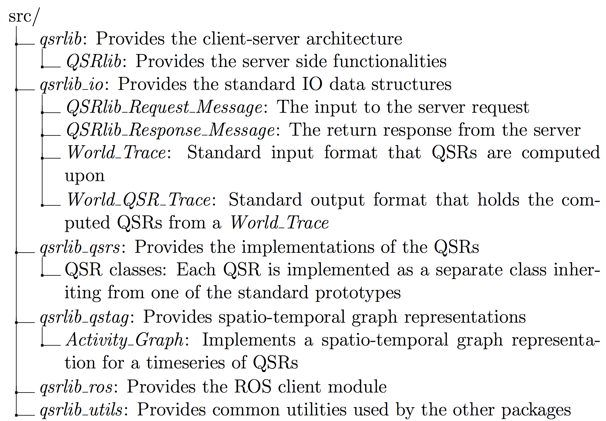

For developers
==============

This section provides information for developers that wish extend QSRlib with new QSRs.
This process consists of two steps:

1. Implement a new QSR
2. Register the new QSR with QSRlib

Howto: New QSRs
---------------

Implementation
~~~~~~~~~~~~~~

Find below a minimally working example:

.. code:: python

    from __future__ import print_function, division
    from qsrlib_qsrs.qsr_dyadic_abstractclass import QSR_Dyadic_1t_Abstractclass

    class QSR_MWE(QSR_Dyadic_1t_Abstractclass):
        _unique_id = "mwe"
        _all_possible_relations = ("left", "together", "right")
        _dtype = "points"

        def __init__(self):
            super(QSR_MWE, self).__init__()

        def _compute_qsr(self, data1, data2, qsr_params, **kwargs):
            return {
                data1.x < data2.x: "left",
                data1.x > data2.x: "right"
            }.get(True, "together")

Line-by-line explanation
^^^^^^^^^^^^^^^^^^^^^^^^

.. code:: python

    class QSR_MWE(QSR_Dyadic_1t_Abstractclass):

Our class inherits from one of the special case abstract classes (more
to this later). For now, we need to define the following abstract properties.

.. code:: python

        _unique_id = "mwe"
        _all_possible_relations = ("left", "together", "right")
        _dtype = "points"

* `_unique_id`: This is the name of the QSR. You can call it what you want but it must be unique among all QSRs and preferably as short as possible with.
* `all_possible_relations`: A list (or tuple) of all the possible values that the QSR can take. It can be anything you like.
* `_dtype`: With what type of data your QSR works with. For example, they might be points, or they might be bounding boxes. For what you can use look in the :class:`QSR abstractclass <qsrlib_qsrs.qsr_abstractclass.QSR_Abstractclass>` `self._dtype_map`.

Then you need to write one function that computes the QSR.

.. code:: python

        def _compute_qsr(self, data1, data2, qsr_params, **kwargs):
            return {
                data1.x < data2.x: "left",
                data1.x > data2.x: "right"
            }.get(True, "together")

.. note::
    There are different types of parent classes that you
    can inherit from. You can see them in the
    :mod:`qsr_monadic_abstractclass.py <qsrlib_qsrs.qsr_monadic_abstractclass>`,
    :mod:`qsr_dyadic_abstractclass.py <qsrlib_qsrs.qsr_dyadic_abstractclass>`, and,
    :mod:`qsr_triadic_abstractclass.py <qsrlib_qsrs.qsr_triadic_abstractclass>`
    module files.

    If one of the "special case" classes like in this example the
    class :class:`QSR_Dyadic_1t_Abstractclass <qsrlib_qsrs.qsr_dyadic_abstractclass.QSR_Dyadic_1t_Abstractclass>`
    does not suit you then you can inherit from one level higher, i.e. from
    :class:`QSR_Dyadic_Abstractclass <qsrlib_qsrs.qsr_dyadic_abstractclass.QSR_Dyadic_Abstractclass>`
    ( or from :class:`QSR_Monadic_Abstractclass <qsrlib_qsrs.qsr_monadic_abstractclass.QSR_Monadic_Abstractclass>`).
    In this case you will also have to provide
    your own
    :meth:`make_world_qsr_trace <qsrlib_qsrs.qsr_abstractclass.QSR_Abstractclass.make_world_qsr_trace>`
    (see the special cases for some example ideas).

    Lastly, if none of the monadic and dyadic family classes allow you to
    implement your QSR (e.g. you want a triadic QSR) then feel free to
    extend it in a similar manner, or file an issue_ and we will consider
    implementing it the quickest possible.

.. _issue: https://github.com/strands-project/strands_qsr_lib/issues

Registration
~~~~~~~~~~~~

Add to `strands_qsr_lib/qsr_lib/src/qsrlib_qsrs/__init__.py` the
following:

Import your class name in the imports (before the `qsrs_registry`
line). E.g. for above QSR add the following line:

.. code:: python

    from qsr_new_mwe import QSR_MWE

Add the new QSR class name in `qsrs_registry`. E.g. for above QSR:

.. code:: python

    qsrs_registry = (<some other QSR class names>,
                     QSR_MWE)

Advanced Topics
---------------

QSR specific parameters
~~~~~~~~~~~~~~~~~~~~~~~

It is possible to change the behavior of a QSR via passing dynamically during the request call argument parameters in
one of its fields that is called `dynamic_args`. It is recommended to read first the documentation on how it is used in
:ref:`this page <dynamic_args>`.

In order use QSR specific parameters you will have to overwrite the method
``_process_qsr_parameters_from_request_parameters(self, req_params, **kwargs)`` in your QSR implementation.

Below is an example on how to do it from
:class:`MOS <qsrlib_qsrs.qsr_moving_or_stationary.QSR_Moving_or_Stationary>` QSR.

.. code:: python

    def _process_qsr_parameters_from_request_parameters(self, req_params, **kwargs):
        """Extract QSR specific parameters from the QSRlib request call parameters.

        :param req_params: QSRlib request call parameters.
        :type req_params: dict
        :param kwargs: kwargs arguments.
        :return: QSR specific parameter settings.
        :rtype: dict
        """
        qsr_params = self.__qsr_params_defaults.copy()
        try:
            qsr_params["quantisation_factor"] = float(req_params["dynamic_args"][self._unique_id]["quantisation_factor"])
        except (KeyError, TypeError):
            try:
                qsr_params["quantisation_factor"] = float(req_params["dynamic_args"]["for_all_qsrs"]["quantisation_factor"])
            except (TypeError, KeyError):
                pass
        return qsr_params

.. note::
    Make sure that the QSR namespace **has precedence** over the global `'for_all_qsrs'` one.

Software Architecure
--------------------

General overview
~~~~~~~~~~~~~~~~

.. _ROS: http://www.ros.org

QSRlib is based on a client-server architecture implemented in python 2.7
although measures for compatibility with 3.x have been adopted. Furthermore, the library is seamlessly exposed to ROS_, via a provided interface. The following figures presents a flowchart with the main step processes for computing QSRs via the library. Raw data first needs to  be converted into the common input data format of QSRlib, which represents a timeseries of the states of the perceived objects, such Cartesian position and rotation, size of the object in each dimension, and allows other custom information about the objects to be kept on a per QSR-need basis. Utility functions are provided that allow easy conversion of the raw data to this standard input data structure. This input data structure, the names of the requested QSRs to be computed and other options that control their behaviours are used to create a request message to the QSRlib server, which upon computation returns a response message that includes the computed QSRs as an output data structure similar to the input one, i.e. a timeseries of the QSRs between the objects, as well as other information. This was explained in detail in the :doc:`for users <for_users>` section.

.. image:: images/flowchart.pdf
    :width: 500px
    :align: center
    :alt: Flowchart showing the main step processes for computing QSRs via the library.

The following tree shows the list of the main packages and classes that provide the key functionalities.

Packages and classes
~~~~~~~~~~~~~~~~~~~~

.. _classQSRlib:

QSRlib class
^^^^^^^^^^^^

.. image:: images/uml_qsrlib.pdf
    :width: 400px
    :align: center
    :alt: UML class diagram

The :mod:`QSRlib <qsrlib.qsrlib.QSRlib>` class is responsible for handling the requests via the `request\_qsrs` method, which takes a :ref:`QSRlib_Request_Message <classQSRlibReqMsg>` object as an argument. It also holds a registry of the QSRs included in the library through a dictionary whose keys are the unique names of the QSRs and values are class instantiations of the corresponding QSR classes.

.. _classQSRlibReqMsg:

Request message class
^^^^^^^^^^^^^^^^^^^^^

.. image:: images/uml_qsrlib_req_msg.pdf
    :width: 300px
    :align: center
    :alt: UML class diagram

The information needed for QSRlib to process a request is packed in the
:mod:`QSRlib_Request_Message <qsrlib.qsrlib.QSRlib_Request_Message>` class. The minimum information needed is the input data (`input_data`) in the format of a :ref:`World_Trace <classWorldTrace>` object and which QSR(s) are to be computed (`which_qsr`) in the form of a unique string QSR identifier for computing a single QSR, or a list of string identifiers for multiple ones. Optionally, it is possible to change the default behaviours of the requested QSRs by passing a dictionary of appropriate values in the `dynamic_args` argument.

.. _classQSRlibResMsg:

Response message class
^^^^^^^^^^^^^^^^^^^^^^

.. image:: images/uml_qsrlib_res_msg.pdf
    :width: 300px
    :align: center
    :alt: UML class diagram

The information returned by QSRlib is an object of the class :mod:`QSRlib_Request_Message <qsrlib.qsrlib.QSRlib_Response_Message>`, which mainly consists of the computed QSRs in the `qsrs` member and is a :ref:`World_QSR_Trace <classWorldQSRTrace>` object. If requested, a graph representation of QSRs, which contains additional temporal information about them is also returned in the :doc:`qstag <qsrs/qstag>` member.

.. _classWorldTrace:

Input data structure classes
^^^^^^^^^^^^^^^^^^^^^^^^^^^^

.. image:: images/uml_input_classes.pdf
    :align: center
    :alt: UML class diagram

QSRs usually require input Cartesian poses of some objects (e.g. TPCC and
distance-based), size of the objects as they work with regions (e.g. RCC and RA), time-series of poses (e.g. QTC). As such, a common and complete representation is needed in order to be able to re-use the data easily and
transparently with a number of different QSRs.

For this reason, QSRlib uses its own input format, which is an object of the
:mod:`World_Trace <qsrlib_io.world_trace.World_Trace>` class. This allows to re-use the input data, once the raw data are converted into this standard input format, without the need to do each time specific pre-processing depending on the QSRs' requirements. A further advantage is that developers of new QSRs can expect that the input will always have the same structure.

The variable that holds the objects data is the `World_Trace.trace` member, which is a python dictionary with keys being float timestamps and values being objects of the class :mod:`World_State <qsrlib_io.world_trace.World_State>`. The `World_State` class describes the state of the world at one particular time. Its main members are `timestamp` which is a float variable representing the time of this world state and is the same as the corresponding key in `World_Trace.trace` dictionary, and, `objects` which holds the information about the objects. Like `trace`, `objects` is a dictionary with keys being the unique name of the object and values being objects of the class :mod:`Object_State <qsrlib_io.world_trace.Object_State>`. Finally, an `Object_State` object holds the information about an object in the world at that particular timestamp. `Object_State` has already members for the most common spatial information about an object, such as coordinates, size and rotation, and allows dynamic expandability if needed by a QSR via dynamic arguments in its constructor.

.. _classWorldQSRTrace:

Output data structure class
^^^^^^^^^^^^^^^^^^^^^^^^^^^

.. image:: images/uml_output_classes.pdf
    :align: center
    :alt: UML class diagram

QSRs are commonly represented symbolically, for example :doc:`RCC8 <qsrs/rcc8>` relations are denoted as 'dc' for 'disconnected', 'po' for 'partially overlapping', 'eq' for 'is equal to', etc. The output of QSRlib is in a standard format similar to the input one. It is an object of the class :mod:`World_QSR_Trace <qsrlib_io.world_qsr_trace.World_QSR_Trace>`. The main member is `trace` which is a dictionary where typically with the exception of specific QSRs (e.g. validated QTC series) the keys are the same timestamps as in the `World_Trace.trace` dictionary, and the values are objects of :mod:`World_QSR_State <qsrlib_io.world_qsr_trace.World_QSR_State>`. A `World_QSR_State` object holds the QSRs at a particular time in the form of a dictionary, called `qsrs`, which has as keys unique string identifiers obtained from the object(s), and values are objects of the class :mod:`QSR <qsrlib_io.world_qsr_trace.QSR>`. The main member of a `QSR` object is a dictionary, called `qsr`, that has as keys the unique names of the QSRs and values the corresponding computed QSR strings.

.. _classQSRs:

QSR classes
^^^^^^^^^^^

Each QSR is implemented in its own class which inherits from one of the
pre-defined abstract prototype classes. The lower level, with respect to inheritance hierachy, prototypes aim to make the implementation of new QSRs as quick and easy as possible by providing interfaces that hide most of the common QSRlib backend code. Higher level prototypes provide incremental freedom at the cost of writing more code, with the top level abstract class giving complete flexibility to implement any type of QSR.

The following diagram shows a sample of the existing QSRs and their inheritance hierarchy.

.. image:: images/qsr_hierarchy_inheritance.pdf
    :align: center
    :alt: Class inheritance diagram

Typically a QSR class should not need to inherit directly from the top level prototype (:mod:`QSR_Abstractclass <qsrlib_qsrs.qsr_abstractclass.QSR_Abstractclass>`). Level 2 abstract classes specify generic prototypes for computing QSRs over a single object (:mod:`QSR_Monadic_Abstractclass <qsrlib_qsrs.qsr_monadic_abstractclass.QSR_Monadic_Abstractclass>`), a pair of objects (:mod:`QSR_Dyadic_Abstractclass <qsrlib_qsrs.qsr_dyadic_abstractclass.QSR_Dyadic_Abstractclass>`) or three objects (:mod:`QSR_Triadic_Abstractclass <qsrlib_qsrs.qsr_triadic_abstractclass.QSR_Triadic_Abstractclass>`). If a new QSR requires four objects or more then it can inherit directly from the top level (`QSR_Abstractclass`). Alternatively, it can firstly implement a level~2 abstract class in a similar manner to the others (and optionally a level~3 also), and inherit directly from it; this is the recommended approach. Level~3 abstract classes are common time-specific special cases. For example, :mod:`QSR_Monadic_2t_Abstractclass <qsrlib_qsrs.qsr_monadic_abstractclass.QSR_Monadic_2t_Abstractclass>` implements the interface for QSRs that require input data of a single object over two different time points; :mod:`QSR_Dyadic_1t_Abstractclass <qsrlib_qsrs.qsr_dyadic_abstractclass.QSR_Dyadic_1t_Abstractclass>` requires input data from two different objects for a single time point, etc.

A specific example of a QSR inheritance is shown in the following UML diagram.

.. image:: images/uml_qsrs_abstracts.pdf
    :align: center
    :alt: QSR inheritance example
