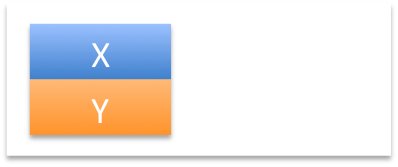
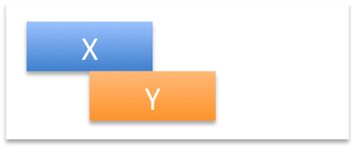
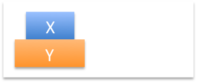
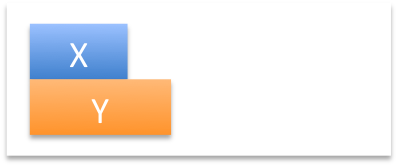
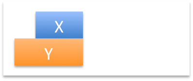

Allen's Interval Algebra
========================

Description
-----------

*Allen's Interval Algebra* [1]_ (AIA) is a system for reasoning about temporal relations. The calculus defines possible relations between time intervals and provides a composition table that can be used as a basis for reasoning about temporal descriptions of events [2]_.

AIA is used in a variety of QSRs and other topics in QSRlib, e.g. in the
:doc:`Regional Algebra <ra>` QSR, in the :doc:`QSR graphs <qstag>`, etc.

Relations
---------

Allen's Interval Algebra defines 13 possible qualitative temporal base relations between two intervals X and Y:

+---------------+--------------+---------------------------+-------------------------------------------------+
| Relation      | Inverse      | Illustration              | Interpretation                                  +
+===============+==============+===========================+=================================================+
| X **<** Y     | Y **>** X    | |allen_before|            | X takes place before Y.                         |
+---------------+--------------+---------------------------+-------------------------------------------------+
| X **=** Y     | Y **=** X    | |allen_equal|             | X is equal to Y.                                |
+---------------+--------------+---------------------------+-------------------------------------------------+
| X **m** Y     | Y **mi** X   | |allen_meets|             | X meets Y.                                      |
+---------------+--------------+---------------------------+-------------------------------------------------+
| X **o** Y     | Y **oi** X   | |allen_overlaps|          | X overlaps with Y.                              |
+---------------+--------------+---------------------------+-------------------------------------------------+
| X **d** Y     | Y **di** X   | |allen_during|            | X takes place during Y.                         |
+---------------+--------------+---------------------------+-------------------------------------------------+
| X **s** Y     | Y **si** X   | |allen_starts|            | X starts Y.                                     |
+---------------+--------------+---------------------------+-------------------------------------------------+
| X **f** Y     | Y **fi** X   | |allen_finishes|          | X finishes Y.                                   |
+---------------+--------------+---------------------------+-------------------------------------------------+

References
----------

.. [1] James F. Allen: Maintaining knowledge about temporal intervals. Communications of the ACM, 1983.

.. [2] Wikipedia: Allen's interval algebra. Wikipedia, accessed October 2015, https://en.wikipedia.org/wiki/Allen%27s_interval_algebra

