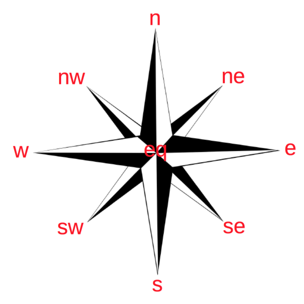

Cardinal Directions
===================

Description
-----------

*Cardinal Directions* (CarDir) are compass relations between two objects, and their minimum set consists of four relations north (n), east (e), south (s) and west (w). Intermediate relations between the main relations are north-east (ne), south-east (se), south-west (sw) and north-west (nw). These relations are shown schematically in the compass rose shown in the figure below, with the addition of an 'equal' (eq) relation when the objects are together.

For the computation of cardinal directions between two regions we use a point-based model (examples are [1]_ [2]_ [3]_ [4]_), i.e. we approximate the regions by their centroid.

API
---

The API can be found :mod:`api <qsrlib_qsrs.qsr_cardinal_direction>`.

References
----------

.. [1] Frank, A.U., 1990. Qualitative Spatial Reasoning about Cardinal Directions. In M. Mark & D. White, eds. Autocarto 10. Baltimore: ACSM/ASPRS.
.. [2] Frank, A.U., 1992. Qualitative spatial reasoning about distances and directions in geographic space. Journal of Visual Languages & Computing, 3(4), pp.343–371.
.. [3] Frank, A.U., 1996. Qualitative Spatial Reasoning: Cardinal Directions as an Example. Geographical Information Systems, 10(3), pp.269–290.
.. [4] Ligozat, G.E., 1998. Reasoning about Cardinal Directions. Journal of Visual Languages & Computing, 9(1), pp.23–44.