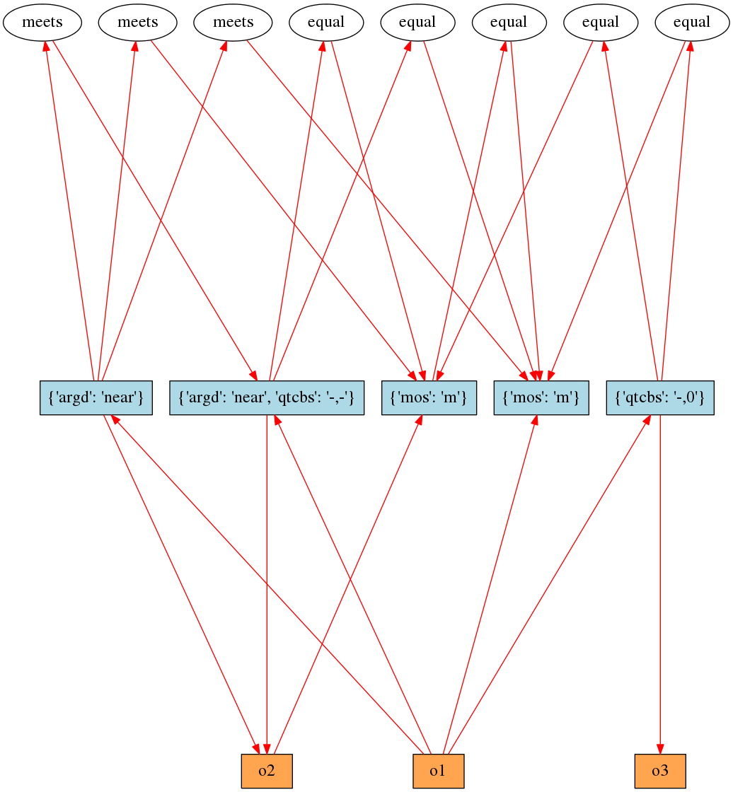
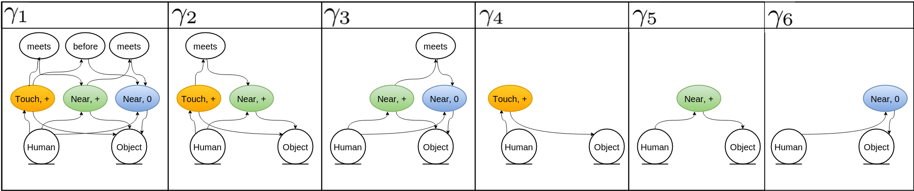

Qualitative Spatio-Temporal Activity Graphs
===========================================

Description
-----------

A Qualitative Spatio-Temporal Activity Graph (QSTAG) provides a compact and efficient graph structure to represent both qualitative spatial and temporal information about entities, allowing the use of standard graph comparison techniques.

We request the QSTAG in the QSRLib framework using the dynamic
argument dictionary: dynamic_args[“qstag”] in the QSRLib Request Message, and it is returned in the QSRLib Response Message as a class qstag(), with main class components episodes (list), graph (iGraph object) and graphlets() (class).

Episodes
--------

To begin, the QSR_World_Trace is converted into a QSR Episode representation.
We define a QSR episode as a compressed, subsequent, set of the same qualitative relation between a set of entities. An episode is then expressed as a tuple containing an entity set, a set of QSR relations, and an interval of time over which they hold. An example episode:

                  ( [human, door], \{QTCbs: [+, 0]\}, (0, 10) ).

The list of all QSR episodes generated from the QSR_World_Trace is returned in:

                  QSRLib_Response_Message.qstag.episodes

QSTAG
-----

From a list of QSR episodes, a QSTAG is generated by abstracting over the temporal sequence of episodes. This is done by taking the Allen interval algebra (IA) [1]_ relation between each pair of episodes in the set.
The structure of a QSTAG is comprised of the following three layers, and a directed edge set:

- An objects layer, containing one nodes per unique object in the set of QSR episodes.
- A spatial episode layer, containing one node per QSR episode in the given set.
- An Allen temporal relations layer, containing one node per pair of QSR episodes and encoding the IA relation that holds between the two QSR episodes.

An example of a QSTAG:

consisting of two objects, three QSR episodes (encoding Argument Distance and QTCbs relations), and three IA relation nodes which hold between the episodes' intervals.

For a QSTAG, an iGraph object is returned in QSRLib_Response_Message.qstag.graph and a utility function is provided for creating a dot image file, available in qsrlib_qstag.utils.graph2dot(<< qstag >>, "<<file\_path>>.dot")} module.

Graphlets
---------

A graphical representation of a timeseries of QSRs facilitates the use of graph matching techniques. Given a QSTAG, it is possible to represent this as a set of overlapping subgraphs with certain properties. We define these sub-graphs as graphlets with properties:

 - they maintain the layer structure of a QSTAG,
 - the objects layer is restricted to at most $n$ objects,
 - the spatial episode layer contains up to $m$ QSR episode nodes which are contiguous in time; this allows the sub-graphs to temporally overlap,
 - the temporal layer contains up to (m*(m-1))/2 IA relation nodes (one per pair of spatial episode nodes), where n and m are supplied parameters in the dynamic argument dictionary (more details below).

This allows the QSTAG to be represented as a bag of overlapping graphlets, where each graphlet obeys the four properties. The example QSTAG above can be represented as a set of six graphlets which hold the above properties using n=2 and m=3. All are displayed here:

Graphlets() is a sub-class of a QSTAG and contains all the information about the graphlets of a QSTAG and is returned in:

                  QSRLib_Response_Message.qstag.graphlets

The main members of the Graphlet class are graphlets (a dictionary), code_book (a list) and histogram (a list).

Each graphlet generated from a QSTAG is represented as both an iGraph object, and also as a graph hash code for efficient comparisons. The Graphlets.graphlets dictionary combines the two as key-value pairs, where keys are unique hash codes, and values are the corresponding iGraph objects; Returned in:

                  QSRLib_Response_Message.qstag.graphlets.graphlets.

Also returned in the Response Message is a code book of the unique hash codes, and a histogram of the number of occurrences in the QSTAG (both lists - in the same order); Returned in:

                  QSRLib_Response_Message.qstag.graphlets.code_book
                  QSRLib_Response_Message.qstag.graphlets.histogram

A code book and histogram lists are intended to be zipped together and allow for easy post analysis of multiple QSTAGs representing multiple observations. Implementation details of these attributes are given in the below section.

.. _usage:

Usage
-----

To use, first create a QSR_World_Trace (qsrlib_response_message) in the normal way.

**Standard Steps for Creating QSR_World_Trace:**

* Create a QSRlib object
* Convert your data in to QSRlib standard input format
* Make a request to QSRlib (or a request to QSRlib using ROS)

**Steps for Creating a QSTAG:**

Make sure "qstag" is a key of the dynamic argument dictionary when you make a request to QSRLib.
Then the response message will contain a QSTAG object:

.. code:: python

    qstag = qsrlib_response_message.qstag

The value of the dynamic_args["qstag"] dictionary must contain a dictionary of graphlet *parameters*, which includes the min and max number of object rows included in the graohlet and a maximum number of spatial episode nodes. Optionally a dictionary of *object types* can also be supplied. Also, if you want the spatial relations only created for certain objects, use the `qsr_for` dictionary. An example is give here:

.. code:: python

    object_types = {"o1": "Human",
                    "o2": "Chair"}

    which_qsr = ["qtcbs", "argd", "mos"]

    dynamic_args = {"qtcbs": {"quantisation_factor": args.quantisation_factor,
                              "validate": args.validate,
                              "no_collapse": args.no_collapse,
                              "qsrs_for": [("o1", "o2"),("o1", "o3")]},

                    "argd": {"qsr_relations_and_values": args.distance_threshold,
                              "qsrs_for":  [("o1", "o2")]},

                    "mos": {"qsrs_for": [("o1"), ("o2")]},

                    "qstag": {"params" : {"min_rows":1, "max_rows":1, "max_eps":3}
                             {"object_types" : object_types}}
                    }

Visualize the QSTAG
-------------------

A utility function to save the QSTAG as a dot file, and convert it to a png image is provided in the `qsrlib_qstag.utils.graph2dot(<qstag>, "<file_path>.dot")` module. E.g.

.. code:: python

    qstag = qsrlib_response_message.qstag
    qsrlib_qstag.utils.graph2dot(qstag, '/tmp/act_gr.dot')
    os.system('dot -Tpng /tmp/act_gr.dot -o /tmp/act_gr.png')

Parse the Episodes, QSTAG and Graphlets
---------------------------------------

.. code:: python

    qstag = qsrlib_response_message.qstag

    print("All the Episodes...")
    for episode in qstag.episodes:
        print(episode)

    print("The QSTAG iGraph: \n", qstag.graph)

    print("All the Graph NODES:")
    for node in qstag.graph.vs():
        print(node)

    print("All the Graph EDGES:")
    for edge in qstag.graph.es():
        print(edge, " from: ", edge.source, " to: ", edge.target)

    print("Graphlets:")
    for i, j in qstag.graphlets.graphlets.items():
        print("\n", i, j)

    print("Histogram:")
    for i, j in zip(qstag.graphlets.code_book, qstag.graphlets.histogram):
        print("\n", i, ": ", j)

Example of QSTAG code
---------------------

An example script for generating a simple QSTAG is available in `/strands_qsr_lib/qsr_lib/scripts/`:

.. code:: bash

    ./qstag_example.py <qsr_name>

e.g.

.. code:: bash

    ./qstag_example.py qtcbs

References
----------

.. [1] James F. Allen: Maintaining knowledge about temporal intervals. Communications of the ACM, 1983.
